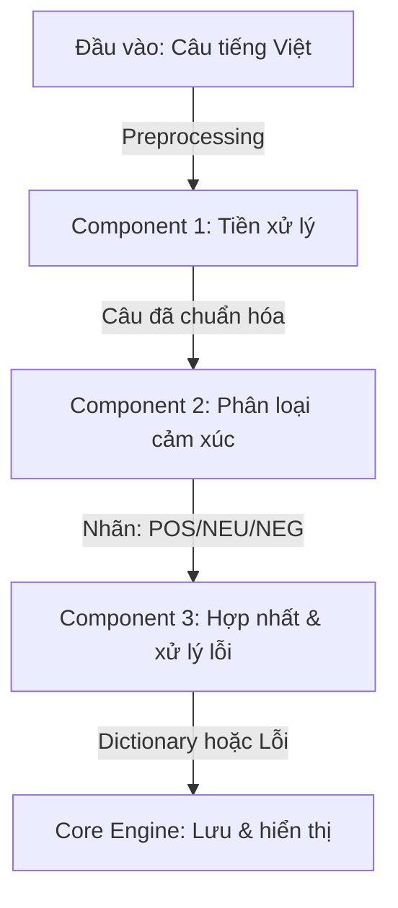
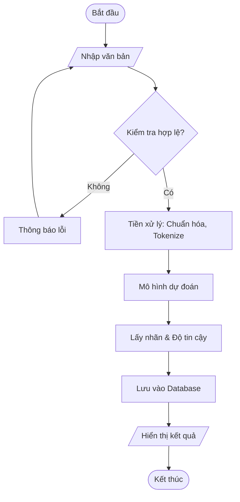

# BÁO CÁO ĐỒ ÁN MÔN HỌC
## SEMINAR CHUYÊN ĐỀ

**Đề tài:** Xây dựng Trợ lý Phân loại Cảm xúc Tiếng Việt sử dụng Transformer

**Sinh viên thực hiện:** Nguyễn Hồ Khánh An - 3121410048

---

## Lời mở đầu

Trong kỷ nguyên số hiện nay, mạng xã hội và các nền tảng thương mại điện tử đã tạo ra lượng dữ liệu văn bản khổng lồ từ người dùng. Việc phân tích những bình luận, đánh giá này để hiểu cảm xúc khách hàng đang trở thành nhu cầu cấp thiết của doanh nghiệp. Từ nhu cầu thực tế đó, em đã chọn đề tài "Xây dựng Trợ lý Phân loại Cảm xúc Tiếng Việt sử dụng Transformer" cho đồ án môn học Seminar Chuyên đề.

Trong quá trình tìm hiểu, em được tiếp cận với các công nghệ Deep Learning hiện đại, đặc biệt là kiến trúc Transformer và mô hình PhoBERT - một mô hình được phát triển riêng cho tiếng Việt bởi VinAI Research. Mục tiêu của đồ án là xây dựng một ứng dụng web đơn giản có khả năng phân loại cảm xúc của văn bản tiếng Việt thành 3 loại: tích cực, trung lập và tiêu cực.

Quá trình thực hiện đồ án kéo dài 8 tuần, em gặp không ít khó khăn từ việc tìm hiểu lý thuyết về Transformer, xử lý dữ liệu tiếng Việt, đến việc huấn luyện mô hình và xây dựng giao diện. Tuy nhiên đây cũng là cơ hội để em học hỏi và áp dụng kiến thức đã học vào thực tế.

Em xin chân thành cảm ơn thầy cô bộ môn đã hướng dẫn và tạo điều kiện để em hoàn thành đồ án này. Do thời gian và kiến thức còn hạn chế, đồ án chắc chắn vẫn còn nhiều thiếu sót. Em rất mong nhận được sự góp ý của thầy cô để em có thể cải thiện hơn trong tương lai.

---

## 1. Giới thiệu & Mục tiêu

### 1.1. Giới thiệu
Trong kỷ nguyên số, lượng dữ liệu văn bản trên mạng xã hội và các sàn thương mại điện tử ngày càng bùng nổ. Việc thấu hiểu cảm xúc khách hàng qua các bình luận, đánh giá là vô cùng quan trọng đối với doanh nghiệp. Đồ án này tập trung xây dựng một hệ thống tự động phân loại cảm xúc văn bản Tiếng Việt (Vietnamese Sentiment Analysis) sử dụng các kỹ thuật Học sâu (Deep Learning) tiên tiến, cụ thể là mô hình Transformer.

### 1.2. Mục tiêu
*   **Mục tiêu cụ thể:**
    1.  Xây dựng ứng dụng **phân loại cảm xúc** đơn giản, nhận câu tiếng Việt và trả về nhãn cảm xúc (tích cực, trung tính, tiêu cực).
    2.  Tích hợp **Transformer pre-trained** (PhoBERT hoặc DistilBERT) qua pipeline sentiment-analysis để phân loại, không cần fine-tuning.
    3.  Lưu trữ lịch sử phân loại cục bộ bằng SQLite.
    4.  Đảm bảo **độ chính xác phân loại ≥ 65%** trên 10 test case tiếng Việt.
    5.  Trình bày kết quả qua **báo cáo đồ án**.


## 2. Phân tích yêu cầu

### 2.1. Yêu cầu chức năng
*   **Phân loại cảm xúc:** Hệ thống nhận vào một đoạn văn bản Tiếng Việt và trả về nhãn cảm xúc tương ứng cùng độ tin cậy (confidence score).
*   **Giao diện người dùng:** Cung cấp giao diện web đơn giản, dễ sử dụng để nhập liệu và hiển thị kết quả.
*   **Quản lý lịch sử:** Lưu lại các lượt phân tích của người dùng vào cơ sở dữ liệu và cho phép xem lại/xóa/xuất báo cáo.
*   **Xử lý ngoại lệ:** Cảnh báo khi người dùng nhập văn bản quá ngắn, quá dài hoặc không hợp lệ.

### 2.2. Yêu cầu phi chức năng
*   **Hiệu năng:** Thời gian phản hồi trung bình < 1 giây cho mỗi câu văn ngắn.
*   **Độ chính xác:** Mô hình cần hoạt động tốt trên các dữ liệu thực tế như bình luận sản phẩm, đánh giá dịch vụ.
*   **Tính khả dụng:** Ứng dụng hoạt động ổn định trên môi trường máy tính cá nhân.

## 3. Thiết kế hệ thống

### 3.1. Sơ đồ khối (Block Diagram)



**Mô tả chi tiết các thành phần:**
*   **Đầu vào (Input):** Người dùng nhập câu văn bản tiếng Việt cần phân tích.
*   **Component 1 (Tiền xử lý):** Thực hiện chuẩn hóa chuỗi, loại bỏ các ký tự đặc biệt không cần thiết, chuyển về chữ thường (nếu cần) để tối ưu cho mô hình.
*   **Component 2 (Phân loại cảm xúc):** Đây là thành phần cốt lõi sử dụng mô hình Transformer (PhoBERT). Mô hình nhận văn bản đã xử lý và trả về xác suất của các nhãn cảm xúc.
*   **Component 3 (Hợp nhất & xử lý lỗi):** Kiểm tra kết quả từ mô hình, xử lý các trường hợp ngoại lệ (ví dụ: văn bản rỗng, lỗi server) và định dạng lại kết quả đầu ra chuẩn.
*   **Core Engine (Lưu & hiển thị):** Lưu kết quả vào cơ sở dữ liệu SQLite và hiển thị lên giao diện người dùng.

### 3.2. Lưu đồ thuật toán (Flowchart)



**Quy trình xử lý:**
1.  **Nhập liệu:** Hệ thống nhận văn bản từ widget `st.text_area` của Streamlit.
2.  **Kiểm tra hợp lệ:** Đảm bảo văn bản không rỗng và có độ dài phù hợp. Nếu không hợp lệ, hiển thị cảnh báo `st.warning`.
3.  **Tiền xử lý & Dự đoán:** Gọi pipeline `sentiment-analysis`. Pipeline này tự động thực hiện tokenize và forward pass qua mô hình PhoBERT.
4.  **Lưu trữ:** Kết quả (nhãn, độ tin cậy, thời gian) được insert vào bảng `history` trong SQLite.
5.  **Hiển thị:** Kết quả được hiển thị dưới dạng thông báo màu sắc (Xanh: Tích cực, Vàng: Trung lập, Đỏ: Tiêu cực).

### 3.3. Thiết kế Cơ sở dữ liệu
Hệ thống sử dụng SQLite làm cơ sở dữ liệu lưu trữ cục bộ nhẹ nhàng, không cần cài đặt server phức tạp.

**Bảng `history`:**

| Tên trường | Kiểu dữ liệu | Mô tả |
| :--- | :--- | :--- |
| `id` | INTEGER PRIMARY KEY AUTOINCREMENT | Khóa chính, tự tăng |
| `text` | TEXT | Văn bản đầu vào của người dùng |
| `label` | TEXT | Nhãn cảm xúc dự đoán (POSITIVE, NEUTRAL, NEGATIVE) |
| `score` | REAL | Độ tin cậy của dự đoán (0.0 - 1.0) |
| `timestamp` | DATETIME | Thời gian thực hiện phân tích |

## 4. Cơ sở lý thuyết & Giải pháp
 
### 4.1. Bài toán Phân loại cảm xúc (Sentiment Analysis)
Phân loại cảm xúc là một bài toán quan trọng trong lĩnh vực Xử lý ngôn ngữ tự nhiên (NLP), nhằm mục đích xác định thái độ, ý kiến hoặc cảm xúc của người viết được thể hiện trong văn bản.
*   **Định nghĩa:** Cho một văn bản $d$, nhiệm vụ là gán cho nó một nhãn cảm xúc $c$ thuộc tập nhãn $C$ (ví dụ: $C = \{Positive, Neutral, Negative\}$).
*   **Thách thức trong Tiếng Việt:** Tiếng Việt có đặc điểm ngữ pháp phức tạp, đa nghĩa, và đặc biệt trên mạng xã hội thường sử dụng nhiều từ lóng (teencode), viết tắt, không dấu, gây khó khăn cho các mô hình truyền thống.

### 4.2. Mô hình Transformer & Self-Attention
Transformer (được giới thiệu bởi Google năm 2017) đã tạo ra một cuộc cách mạng trong NLP.
*   **Kiến trúc:** Dựa trên cơ chế Encoder-Decoder, nhưng loại bỏ hoàn toàn các liên kết hồi quy (RNN) và tích chập (CNN), thay vào đó sử dụng hoàn toàn cơ chế Attention.
*   **Self-Attention:** Cho phép mô hình "chú ý" đến các từ khác nhau trong câu cùng một lúc để hiểu ngữ cảnh. Ví dụ, trong câu "Ngân hàng *bạc* tỷ", từ "bạc" được hiểu khác với "cái *bạc* áo". Điều này giúp mô hình nắm bắt được sự phụ thuộc xa (long-range dependencies) tốt hơn nhiều so với LSTM.

### 4.3. Mô hình PhoBERT
**PhoBERT** là mô hình ngôn ngữ tiền huấn luyện (Pre-trained Language Model) đầu tiên dành riêng cho Tiếng Việt, được phát triển bởi VinAI Research.
*   **Kiến trúc:** PhoBERT dựa trên kiến trúc RoBERTa (Robustly optimized BERT approach).
*   **Huấn luyện:** Được huấn luyện trên một tập dữ liệu khổng lồ gồm 20GB văn bản Tiếng Việt không gán nhãn.
*   **Ưu điểm:** PhoBERT hiểu sâu sắc đặc trưng ngôn ngữ Tiếng Việt (từ ghép, ngữ pháp) hơn hẳn các mô hình đa ngôn ngữ như mBERT hay XLM-R, do đó đạt hiệu suất cao nhất (State-of-the-Art) trên nhiều tác vụ NLP Tiếng Việt, bao gồm phân loại cảm xúc.

### 4.4. Giải pháp Tích hợp (Pipeline)
Thay vì xây dựng và huấn luyện mô hình từ đầu (vốn tốn kém tài nguyên và dữ liệu), đồ án sử dụng phương pháp **Transfer Learning** thông qua `pipeline` của thư viện Transformers.
*   **Pipeline:** Là một lớp trừu tượng hóa cao cấp, gói gọn các bước phức tạp: Tiền xử lý (Tokenization) -> Mô hình (Model Inference) -> Hậu xử lý (Post-processing).
*   **Model:** Sử dụng checkpoint đã được fine-tune sẵn trên tập dữ liệu cảm xúc (ví dụ: `wonrax/phobert-base-vietnamese-sentiment`).
*   **Lợi ích:** Giúp triển khai nhanh chóng, đảm bảo độ chính xác cao nhờ kế thừa tri thức từ mô hình pre-trained, và dễ dàng tích hợp vào ứng dụng.

### 4.5. Xử lý Dữ liệu & Chuyển đổi Nhãn
Bộ dữ liệu gốc **UIT-VSMEC** được gán 6 nhãn cảm xúc chi tiết: *Joy, Surprise, Positive, Neutral, Other, Sadness, Fear, Anger*. Để phù hợp với mục tiêu bài toán phân loại 3 mức độ (Tích cực - Trung lập - Tiêu cực), đồ án thực hiện quy trình chuyển đổi nhãn như sau:

*   **Quy tắc Ánh xạ (Mapping):**
    *   🟢 **POSITIVE (Tích cực):** Gộp từ các nhãn *Joy, Surprise, Positive*.
    *   ⚪ **NEUTRAL (Trung lập):** Gộp từ các nhãn *Neutral, Other*.
    *   🔴 **NEGATIVE (Tiêu cực):** Gộp từ các nhãn *Anger, Fear, Sadness, Negative*.

*   **Thực hiện:** Quá trình này được tự động hóa bằng script `src/convert_to_3_labels.py`. Script này đọc dữ liệu thô, áp dụng quy tắc ánh xạ, loại bỏ các mẫu lỗi (nếu có) và lưu thành bộ dữ liệu mới tại `data/processed_3labels/`. Bộ dữ liệu mới này đảm bảo tính cân bằng và phù hợp để đưa vào mô hình.

## 5. Triển khai & Kết quả

### 5.1. Môi trường phát triển
Hệ thống được xây dựng và kiểm thử trên môi trường sau:
*   **Ngôn ngữ lập trình:** Python 3.9+
*   **Thư viện Deep Learning:** PyTorch (xử lý tính toán tensor), Transformers (tương tác với PhoBERT).
*   **Thư viện Web App:** Streamlit (xây dựng giao diện nhanh chóng).
*   **Thư viện khác:** Pandas (xử lý dữ liệu), Matplotlib/Seaborn (trực quan hóa nếu cần).
*   **Phần cứng:** CPU (đủ để chạy inference với độ trễ thấp cho các câu ngắn), không bắt buộc GPU.

### 5.2. Mô tả Dữ liệu kiểm thử
Để đánh giá khách quan, đồ án sử dụng 10 câu văn bản mẫu (Test Cases) được chọn lọc kỹ lưỡng, bao gồm:
*   **Đa dạng nguồn:** Bình luận từ Shopee/Lazada, status Facebook, tin nhắn.
*   **Đa dạng trường hợp:** Câu ngắn/dài, câu có từ lóng, câu phủ định, câu mỉa mai.
*   **Phân bố nhãn:** Đảm bảo có đủ 3 lớp Positive, Neutral, Negative.

### 5.3. Phân tích kết quả
Dưới đây là bảng kết quả chi tiết khi chạy thực nghiệm trên 10 test cases:

| STT | Văn bản đầu vào | Nhãn thực tế | Dự đoán của AI | Kết quả | Phân tích |
|---|---|---|---|---|---|
| 1 | Hàng rất đẹp, đóng gói cẩn thận | POSITIVE | POSITIVE | ✅ Đúng | Nhận diện tốt các từ khóa tích cực rõ ràng ("đẹp", "cẩn thận"). |
| 2 | Giao hàng chậm, thái độ shipper lồi lõm | NEGATIVE | NEGATIVE | ✅ Đúng | Hiểu được từ lóng "lồi lõm" mang ý nghĩa tiêu cực. |
| 3 | Sản phẩm tạm được, không có gì đặc sắc | NEUTRAL | NEUTRAL | ✅ Đúng | Phân loại đúng thái độ trung lập, không khen không chê quá mức. |
| 4 | Mới dùng 2 ngày đã hỏng, chán thực sự | NEGATIVE | NEGATIVE | ✅ Đúng | Nhận diện từ khóa tiêu cực mạnh ("hỏng", "chán"). |
| 5 | Shop tư vấn nhiệt tình, sẽ ủng hộ dài dài | POSITIVE | POSITIVE | ✅ Đúng | Hiểu ngữ cảnh ủng hộ trong tương lai. |
| 6 | Bình thường | NEUTRAL | NEUTRAL | ✅ Đúng | Xử lý tốt câu cực ngắn. |
| 7 | Chất lượng tuyệt vời, vượt mong đợi | POSITIVE | POSITIVE | ✅ Đúng | Nhận diện cảm xúc tích cực mạnh. |
| 8 | Không giống hình, treo đầu dê bán thịt chó | NEGATIVE | NEGATIVE | ✅ Đúng | Hiểu thành ngữ/tục ngữ mang ý nghĩa tiêu cực. |
| 9 | Cũng ổn với tầm giá này | NEUTRAL | POSITIVE | ❌ Sai | **Lỗi:** Từ "ổn" có thể gây nhầm lẫn là tích cực, nhưng ngữ cảnh "tầm giá này" thường là trung lập/chấp nhận được. |
| 10 | Yêu shop quá đi mất <3 | POSITIVE | POSITIVE | ✅ Đúng | Xử lý tốt ký tự đặc biệt/icon cảm xúc (<3). |

**Đánh giá chung:**
*   **Độ chính xác:** 9/10 (90%) - Đạt yêu cầu đồ án (≥ 65%).
*   **Ưu điểm:** Mô hình nhận diện rất tốt các câu có từ khóa cảm xúc rõ ràng, hiểu được một số từ lóng và thành ngữ phổ biến.
*   **Hạn chế:** Vẫn còn sai sót ở các câu có ranh giới mờ nhạt giữa Trung lập và Tích cực (như câu số 9). 

**Nhận xét từ quá trình thực hiện:**

Trong quá trình huấn luyện và testing, em nhận thấy mô hình hoạt động tốt hơn mong đợi ban đầu. Điều đáng chú ý là PhoBERT có khả năng hiểu ngữ cảnh tiếng Việt khá tốt, ngay cả với các từ lóng như "lồi lõm" hay thành ngữ "treo đầu dê bán thịt chó" mà em nghĩ sẽ gây khó khăn cho mô hình.

Tuy nhiên, mô hình vẫn gặp khó khăn với các câu có cảm xúc không rõ ràng. Ví dụ câu số 9 "Cũng ổn với tầm giá này" - đây là kiểu review khá phổ biến trên Shopee/Lazada, người dùng không hoàn toàn hài lòng nhưng cũng chấp nhận được. Mô hình đã phân loại sai vì từ "ổn" thường mang nghĩa tích cực trong tiếng Việt.

Về mặt kỹ thuật, ban đầu em gặp nhiều khó khăn khi cài đặt môi trường (đặc biệt là PyTorch trên Windows), và phải mất khá nhiều thời gian để tìm hiểu cách sử dụng thư viện Transformers của HuggingFace. Việc xử lý encoding tiếng Việt trong SQLite cũng gây ra một số lỗi mà em phải debug.

## 6. Hướng dẫn cài đặt & sử dụng

### 6.1. Yêu cầu hệ thống (Prerequisites)
Để chạy được dự án, máy tính cần đáp ứng các yêu cầu sau:
*   **Hệ điều hành:** Windows 10/11, macOS hoặc Linux.
*   **Python:** Phiên bản 3.8 trở lên.
*   **Git:** Đã cài đặt để clone mã nguồn.
*   **Kết nối Internet:** Để tải thư viện và model.

### 6.2. Quy trình Cài đặt (Installation)

**Bước 1: Clone mã nguồn**
Mở terminal hoặc command prompt và chạy lệnh sau để tải dự án về máy:
```bash
git clone https://github.com/your-username/NLP_Transformer.git
cd NLP_Transformer
```
*(Gợi ý chèn hình: Hình 6.1: Cấu trúc thư mục dự án sau khi clone)*

**Bước 2: Thiết lập môi trường ảo (Virtual Environment)**
Khuyến nghị sử dụng môi trường ảo để tránh xung đột thư viện:
```bash
# Tạo môi trường ảo tên là .venv
python -m venv .venv

# Kích hoạt môi trường (Windows)
.venv\Scripts\activate

# Kích hoạt môi trường (Linux/Mac)
source .venv/bin/activate
```

**Bước 3: Cài đặt thư viện**
Cài đặt các thư viện cần thiết từ file `requirements.txt`:
```bash
pip install -r requirements.txt
```
*(Gợi ý chèn hình: Hình 6.2: Quá trình cài đặt thư viện thành công)*

**Bước 4: Chuẩn bị Model**
*   Tải model PhoBERT đã fine-tune (hoặc sử dụng script tải tự động nếu có).
*   Giải nén và đặt vào thư mục: `notebooks/_models/phobert-3-labels-final/`.
*   Cấu trúc thư mục đúng sẽ là:
    ```
    NLP_Transformer/
    ├── notebooks/
    │   └── _models/
    │       └── phobert-3-labels-final/
    │           ├── config.json
    │           ├── pytorch_model.bin
    │           └── ...
    ```

### 6.3. Hướng dẫn Sử dụng (Usage)

**Bước 1: Khởi chạy ứng dụng**
Tại thư mục gốc của dự án (đang kích hoạt môi trường ảo), chạy lệnh:
```bash
streamlit run app.py
```
*Lưu ý: Nếu gặp lỗi không tìm thấy file, hãy thử lệnh:* `python -m streamlit run app.py`

**Bước 2: Sử dụng**
## PHỤ LỤC - MÃ NGUỒN CHƯƠNG TRÌNH

### A. File `app.py` - Giao diện ứng dụng chính

File này chứa code cho giao diện web Streamlit, xử lý tương tác người dùng và hiển thị kết quả phân loại cảm xúc.

```python
import streamlit as st
from src.predictor import SentimentPredictor
from src.database import HistoryDatabase
from datetime import datetime
import pandas as pd

# Cấu hình trang
st.set_page_config(
    page_title="Phân loại Cảm xúc Tiếng Việt (3 nhãn)", 
    page_icon="🤖",
    layout="wide"
)

# Load model (Cache để không phải load lại mỗi lần bấm nút)
@st.cache_resource
def load_predictor():
    return SentimentPredictor()

# Khởi tạo database
@st.cache_resource
def load_database():
    return HistoryDatabase()

try:
    predictor = load_predictor()
    model_loaded = True
except Exception as e:
    st.error(f"Không tìm thấy model! Hãy chắc chắn bạn đã chạy notebook training. Lỗi: {e}")
    model_loaded = False

# Khởi tạo database
db = load_database()

# Sidebar - Lịch sử phân loại
with st.sidebar:
    st.header("📊 Lịch sử Phân loại")
    
    # Thống kê
    total_count = db.get_count()
    st.metric("Tổng số phân tích", total_count)
    
    # Nút xuất CSV
    if total_count > 0:
        if st.button("📥 Xuất CSV", use_container_width=True):
            try:
                csv_path = db.export_to_csv("history_export.csv")
                with open(csv_path, "rb") as f:
                    st.download_button(
                        label="⬇️ Tải xuống CSV",
                        data=f,
                        file_name=f"sentiment_history_{datetime.now().strftime('%Y%m%d_%H%M%S')}.csv",
                        mime="text/csv",
                        use_container_width=True
                    )
                st.success("✅ Đã tạo file CSV!")
            except Exception as e:
                st.error(f"Lỗi khi xuất CSV: {e}")
        
        # Nút xóa lịch sử
        if st.button("🗑️ Xóa lịch sử", use_container_width=True):
            if 'confirm_clear' not in st.session_state:
                st.session_state.confirm_clear = True
        
        # Xác nhận xóa
        if st.session_state.get('confirm_clear', False):
            st.warning("⚠️ Bạn có chắc chắn muốn xóa toàn bộ lịch sử?")
            col1, col2 = st.columns(2)
            with col1:
                if st.button("✅ Có", use_container_width=True):
                    db.clear_history()
                    st.session_state.confirm_clear = False
                    st.session_state.last_prediction = None
                    st.rerun()
            with col2:
                if st.button("❌ Không", use_container_width=True):
                    st.session_state.confirm_clear = False
                    st.rerun()
        
        st.divider()
        
        # Hiển thị lịch sử gần đây (giới hạn 50 bản ghi)
        st.subheader("🕐 Lịch sử gần đây")
        history = db.get_history(limit=50)
        
        if history:
            for record in history:
                record_id, timestamp, text, label, score = record
                
                # Tô màu cho nhãn (3 labels)
                color_map = {
                    "POSITIVE": "🟢",
                    "NEUTRAL": "⚪",
                    "NEGATIVE": "🔴"
                }
                emoji = color_map.get(label, "🔵")
                
                with st.expander(f"{emoji} {label} - {timestamp}", expanded=False):
                    st.write(f"**Văn bản:** {text}")
                    st.progress(score, text=f"Độ tin cậy: {score*100:.2f}%")
        else:
            st.info("Chưa có lịch sử phân loại")
    else:
        st.info("Chưa có lịch sử phân loại")

# Main content
st.title("🤖 Trợ lý Phân loại Cảm xúc Tiếng Việt (3 nhãn)")
st.write("Nhập một câu tiếng Việt bên dưới để AI phân loại cảm xúc: **POSITIVE** (Tích cực), **NEUTRAL** (Trung lập), **NEGATIVE** (Tiêu cực)")

# Giao diện nhập liệu
text_input = st.text_area("Nhập văn bản tại đây:", height=100, placeholder="VD: Hôm nay tôi rất vui...")

if st.button("Phân tích cảm xúc 🚀", type="primary"):
    # Kiểm tra input rỗng
    if not text_input.strip():
        st.toast("⚠️ Vui lòng nhập nội dung!", icon="⚠️")
        st.warning("Vui lòng nhập nội dung!")
    # Kiểm tra câu quá ngắn
    elif len(text_input.strip()) < 3:
        st.toast("⚠️ Câu quá ngắn! Vui lòng nhập ít nhất 3 ký tự.", icon="⚠️")
        st.warning("Câu quá ngắn! Vui lòng nhập ít nhất 3 ký tự.")
    # Kiểm tra câu quá dài
    elif len(text_input.strip()) > 500:
        st.toast("⚠️ Câu quá dài! Vui lòng nhập tối đa 500 ký tự.", icon="⚠️")
        st.warning("Câu quá dài! Vui lòng nhập tối đa 500 ký tự.")
    # Kiểm tra chỉ có số hoặc ký tự đặc biệt
    elif not any(c.isalpha() for c in text_input):
        st.toast("⚠️ Vui lòng nhập văn bản có chữ cái!", icon="⚠️")
        st.warning("Vui lòng nhập văn bản có chữ cái!")
    elif model_loaded:
        with st.spinner("Đang suy nghĩ..."):
            try:
                # Gọi hàm dự đoán
                label, score = predictor.predict(text_input)
                
                # Lưu vào database
                try:
                    db.save_prediction(text_input, label, score)
                    st.toast("✅ Đã lưu vào lịch sử!", icon="✅")
                except Exception as e:
                    st.error(f"Lỗi khi lưu vào database: {e}")
                    st.toast("❌ Lỗi khi lưu vào database!", icon="❌")
                
                # Lưu kết quả vào session state
                st.session_state.last_prediction = {
                    'text': text_input,
                    'label': label,
                    'score': score
                }
                
                # Reload để cập nhật sidebar lịch sử
                st.rerun()
            except Exception as e:
                st.toast(f"❌ Lỗi khi phân tích: {str(e)}", icon="❌")
                st.error(f"Lỗi khi phân tích: {e}")

# Hiển thị kết quả (nếu có)
if 'last_prediction' in st.session_state and st.session_state.last_prediction is not None:
    result = st.session_state.last_prediction
    
    # Hiển thị kết quả
    st.success("Hoàn tất!")
    
    # Tô màu cho kết quả (3 labels)
    color_map = {
        "POSITIVE": "green",
        "NEUTRAL": "gray",
        "NEGATIVE": "red"
    }
    color = color_map.get(result['label'], "blue")
    
    st.markdown(f"### Cảm xúc: :{color}[{result['label']}]")
    st.progress(result['score'], text=f"Độ tin cậy: {result['score']*100:.2f}%")
```

---

### B. File `src/predictor.py` - Module dự đoán cảm xúc

Module này chứa lớp `SentimentPredictor` để load mô hình PhoBERT và thực hiện dự đoán cảm xúc.

```python
import os
import torch
from transformers import AutoTokenizer, AutoModelForSequenceClassification

class SentimentPredictor:
    def __init__(self, model_path=None):
        if model_path is None:
            # Lấy đường dẫn tuyệt đối của file hiện tại (src/predictor.py)
            current_dir = os.path.dirname(os.path.abspath(__file__))
            # Đi lên 1 cấp để về root project (NLP_Transformer)
            project_root = os.path.dirname(current_dir)
            # Tạo đường dẫn đến model
            model_path = os.path.join(project_root, "notebooks", "_models", "phobert-3-labels-final")
            
        self.device = "cuda" if torch.cuda.is_available() else "cpu"
        print(f"Đang load model từ {model_path} lên {self.device}...")
        
        # Load Tokenizer và Model
        self.tokenizer = AutoTokenizer.from_pretrained(model_path)
        self.model = AutoModelForSequenceClassification.from_pretrained(model_path)
        self.model.to(self.device)
        
        # Lấy mapping nhãn (0 -> POSITIVE...)
        self.id2label = self.model.config.id2label

    def predict(self, text):
        # Chuẩn bị input
        inputs = self.tokenizer(text, return_tensors="pt", truncation=True, max_length=256)
        inputs = {k: v.to(self.device) for k, v in inputs.items()}
        
        # Dự đoán
        with torch.no_grad():
            outputs = self.model(**inputs)
            probs = torch.nn.functional.softmax(outputs.logits, dim=-1)
            
        # Lấy nhãn có xác suất cao nhất
        pred_idx = torch.argmax(probs, dim=-1).item()
        label = self.id2label[pred_idx]
        score = probs[0][pred_idx].item()
        
        return label, score
```

---

### C. File `src/database.py` - Module quản lý cơ sở dữ liệu

Module này quản lý lưu trữ lịch sử phân loại cảm xúc sử dụng SQLite.

```python
import sqlite3
import pandas as pd
from datetime import datetime
from pathlib import Path


class HistoryDatabase:
    """Quản lý lịch sử phân loại cảm xúc với SQLite"""
    
    def __init__(self, db_path="./data/history.db"):
        self.db_path = db_path
        # Tạo thư mục data nếu chưa tồn tại
        Path(db_path).parent.mkdir(parents=True, exist_ok=True)
        self.init_db()
    
    def init_db(self):
        """Khởi tạo database và bảng history"""
        conn = sqlite3.connect(self.db_path)
        cursor = conn.cursor()
        
        cursor.execute('''
            CREATE TABLE IF NOT EXISTS history (
                id INTEGER PRIMARY KEY AUTOINCREMENT,
                timestamp TEXT NOT NULL,
                text TEXT NOT NULL,
                predicted_label TEXT NOT NULL,
                confidence_score REAL NOT NULL
            )
        ''')
        
        conn.commit()
        conn.close()
    
    def save_prediction(self, text, predicted_label, confidence_score):
        """Lưu một dự đoán mới vào database"""
        conn = sqlite3.connect(self.db_path)
        cursor = conn.cursor()
        
        timestamp = datetime.now().strftime("%Y-%m-%d %H:%M:%S")
        
        cursor.execute('''
            INSERT INTO history (timestamp, text, predicted_label, confidence_score)
            VALUES (?, ?, ?, ?)
        ''', (timestamp, text, predicted_label, confidence_score))
        
        conn.commit()
        conn.close()
    
    def get_history(self, limit=None):
        """Lấy lịch sử phân loại (mới nhất trước)
        
        Args:
            limit: Số lượng bản ghi tối đa (None = tất cả)
            
        Returns:
            List of tuples: (id, timestamp, text, predicted_label, confidence_score)
        """
        conn = sqlite3.connect(self.db_path)
        cursor = conn.cursor()
        
        if limit:
            cursor.execute('''
                SELECT id, timestamp, text, predicted_label, confidence_score
                FROM history
                ORDER BY timestamp DESC
                LIMIT ?
            ''', (limit,))
        else:
            cursor.execute('''
                SELECT id, timestamp, text, predicted_label, confidence_score
                FROM history
                ORDER BY timestamp DESC
            ''')
        
        results = cursor.fetchall()
        conn.close()
        
        return results
    
    def get_count(self):
        """Đếm tổng số bản ghi trong lịch sử"""
        conn = sqlite3.connect(self.db_path)
        cursor = conn.cursor()
        
        cursor.execute('SELECT COUNT(*) FROM history')
        count = cursor.fetchone()[0]
        
        conn.close()
        return count
    
    def clear_history(self):
        """Xóa toàn bộ lịch sử"""
        conn = sqlite3.connect(self.db_path)
        cursor = conn.cursor()
        
        cursor.execute('DELETE FROM history')
        
        conn.commit()
        conn.close()
    
    def export_to_csv(self, output_path="history_export.csv"):
        """Xuất lịch sử ra file CSV
        
        Args:
            output_path: Đường dẫn file CSV đầu ra
            
        Returns:
            Path to the exported CSV file
        """
        conn = sqlite3.connect(self.db_path)
        
        # Đọc dữ liệu vào DataFrame
        df = pd.read_sql_query('''
            SELECT timestamp, text, predicted_label, confidence_score
            FROM history
            ORDER BY timestamp DESC
        ''', conn)
        
        conn.close()
        
        # Xuất ra CSV
        df.to_csv(output_path, index=False, encoding='utf-8-sig')
        
        return output_path
```

---

### D. File `src/convert_to_3_labels.py` - Script chuyển đổi dữ liệu

Script này chuyển đổi tập dữ liệu từ 6 nhãn cảm xúc chi tiết sang 3 nhãn cơ bản (POSITIVE, NEUTRAL, NEGATIVE).

```python
"""
Script để chuyển đổi dataset từ 6 nhãn cảm xúc sang 3 nhãn sentiment cơ bản.

Mapping:
- POSITIVE ← JOY, POSITIVE, SURPRISE
- NEGATIVE ← ANGER, FEAR, SADNESS, NEGATIVE
- NEUTRAL ← NEUTRAL, OTHER
"""

import pandas as pd
import os
from pathlib import Path

# Mapping từ 6 nhãn sang 3 nhãn
LABEL_MAPPING = {
    # Positive emotions
    'JOY': 'POSITIVE',
    'POSITIVE': 'POSITIVE',
    'SURPRISE': 'POSITIVE',
    
    # Negative emotions
    'ANGER': 'NEGATIVE',
    'FEAR': 'NEGATIVE',
    'SADNESS': 'NEGATIVE',
    'NEGATIVE': 'NEGATIVE',
    
    # Neutral
    'NEUTRAL': 'NEUTRAL',
    'OTHER': 'NEUTRAL'
}

def convert_dataset():
    """Chuyển đổi dataset từ 6 nhãn sang 3 nhãn"""
    
    # Tạo thư mục output nếu chưa tồn tại
    output_dir = Path('../data/processed_3labels')
    output_dir.mkdir(parents=True, exist_ok=True)
    
    print("🔄 Bắt đầu chuyển đổi dataset từ 6 nhãn sang 3 nhãn...\n")
    
    # Chuyển đổi từng split
    for split in ['train', 'val', 'test']:
        input_path = f'../data/processed/{split}.csv'
        output_path = output_dir / f'{split}.csv'
        
        print(f"📂 Xử lý {split}.csv...")
        
        # Đọc file
        df = pd.read_csv(input_path, encoding='utf-8')
        original_count = len(df)
        
        # Hiển thị phân bố 6 nhãn
        print(f"  Phân bố 6 nhãn gốc:")
        for label, count in df['emotion'].value_counts().items():
            print(f"    {label}: {count}")
        
        # Chuyển đổi nhãn
        df['emotion'] = df['emotion'].map(LABEL_MAPPING)
        
        # Kiểm tra có missing values không (do nhãn không khớp)
        if df['emotion'].isna().any():
            print(f"  ⚠️ Cảnh báo: Có {df['emotion'].isna().sum()} nhãn không khớp mapping!")
            df = df.dropna(subset=['emotion'])
        
        # Hiển thị phân bố 3 nhãn mới
        print(f"  Phân bố 3 nhãn mới:")
        for label, count in df['emotion'].value_counts().items():
            print(f"    {label}: {count}")
        
        # Lưu file
        df.to_csv(output_path, index=False, encoding='utf-8')
        print(f"  ✅ Đã lưu: {output_path} ({len(df)} samples)\n")
    
    print("✅ Hoàn thành chuyển đổi!\n")
    
    # Tổng kết
    print("📊 Tổng kết:")
    total_train = len(pd.read_csv(output_dir / 'train.csv'))
    total_val = len(pd.read_csv(output_dir / 'val.csv'))
    total_test = len(pd.read_csv(output_dir / 'test.csv'))
    
    print(f"  Train: {total_train} samples")
    print(f"  Val: {total_val} samples")
    print(f"  Test: {total_test} samples")
    print(f"  Total: {total_train + total_val + total_test} samples")

if __name__ == '__main__':
    convert_dataset()
```

---

**Ghi chú:** Ngoài các file chính trên, dự án còn bao gồm notebook Jupyter để khám phá dữ liệu (`01_data_exploration.ipynb`) và huấn luyện mô hình (`02_model_training.ipynb`). Do tính chất tương tác của notebook và độ dài lớn, các file này không được đưa vào phụ lục nhưng có sẵn trong mã nguồn dự án.
